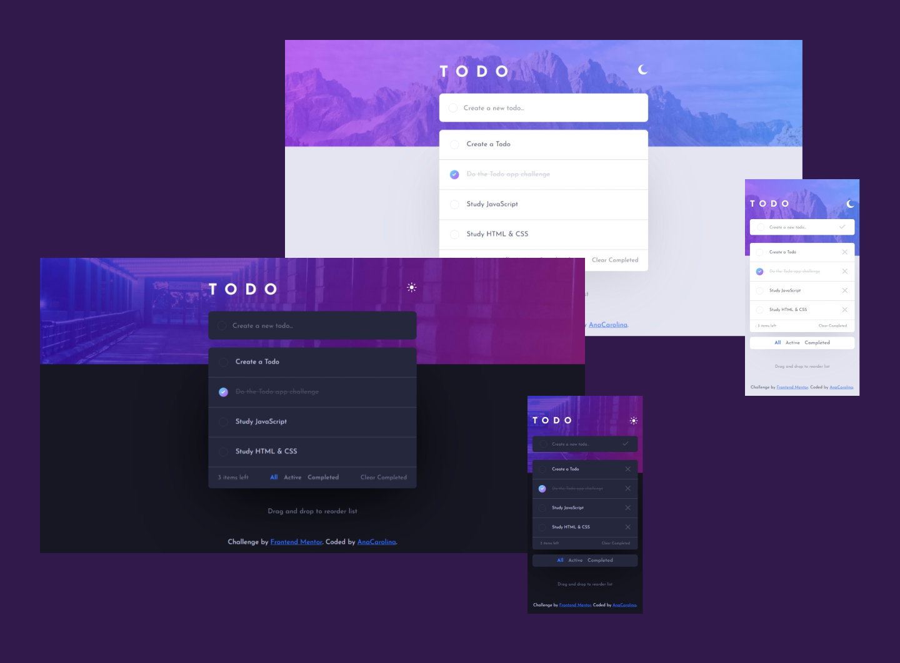

# Frontend Mentor - Todo app solution

This is a solution to the [Todo app challenge on Frontend Mentor](https://www.frontendmentor.io/challenges/todo-app-Su1_KokOW). Frontend Mentor challenges help you improve your coding skills by building realistic projects.

## Table of contents

- [Overview](#overview)
  - [The challenge](#the-challenge)
  - [Screenshot](#screenshot)
  - [Links](#links)
- [My process](#my-process)
  - [Built with](#built-with)
  - [What I learned](#what-i-learned)
  - [Continued development](#continued-development)
  - [Useful resources](#useful-resources)
- [Author](#author)

## Overview

### The challenge

Users should be able to:

- View the optimal layout for the app depending on their device's screen size
- See hover states for all interactive elements on the page
- Add new todo to the list
- Mark todo as complete
- Delete todo from the list
- Filter by all/active/complete todo
- Clear all completed todo
- Toggle light and dark mode
- **Bonus**: Drag and drop to reorder items on the list

### Screenshot

### Links

- Solution URL: [Add solution URL here]()
- Live Site URL: [Add live site URL here]()

## My process

### Built with

- Semantic HTML5 markup
- CSS custom properties
- FlexBox
- CSS Grid
- Mobile-first workflow
- JavaScript
- LocalStorage
- [MVC: Model-View-Controller](https://developer.mozilla.org/en-US/docs/Glossary/MVC)

### What I learned

Throughout this project, I applied some of the concepts I've been studying, such as array methods and how to store and retrieve data from Local Storage. Furthermore, I used the Event Delegation pattern to handle the different buttons and the MVC pattern to a better division of the UI and the data store logic. Besides this, I learned how to implement the drag/drop functionality to reorder the list.

### Continued development

This project was an outstanding opportunity to apply and learn a lot of concepts. In future projects, I want to focus more on different software design patterns like the MVC since it helped me better organize the scripts. Moreover, I plan to refactor this project to use IndexDB instead of LocalStorage because it better suits the purpose of a To-Do app.

### Useful resources

- [A (more) Modern CSS Reset](https://andy-bell.co.uk/a-more-modern-css-reset/) - A better way to reset the CSS styles.

- [Frontend Web Development: In-Depth Project Tutorial (HTML, CSS, JavaScript, TypeScript, React)](https://youtu.be/MsnQ5uepIaE?si=t2j5Tf-ogvy0WqVB) - This freeCodeCamp tutorial is awesome! It was with it that I learned about the MVC.

- [Event Delegation in JavaScript –Explained with an Example](https://www.freecodecamp.org/news/event-delegation-javascript/) - This article explains why it is better to use Event Delegation than add an Event Listener to each interactive UI element.

- [Sort an array with another array](https://clubmate.fi/sort-array-with-array) - This article helped me understand how to sort an array based on another array in JavaScript.

- [The `hidden` Attribute is Visibly Weak](https://css-tricks.com/the-hidden-attribute-is-visibly-weak/) - Interesting article about the `hidden` HTML tag attribute.

## Author

- Frontend Mentor - [AnaCarolina](https://www.frontendmentor.io/profile/AnaCarol2001)
